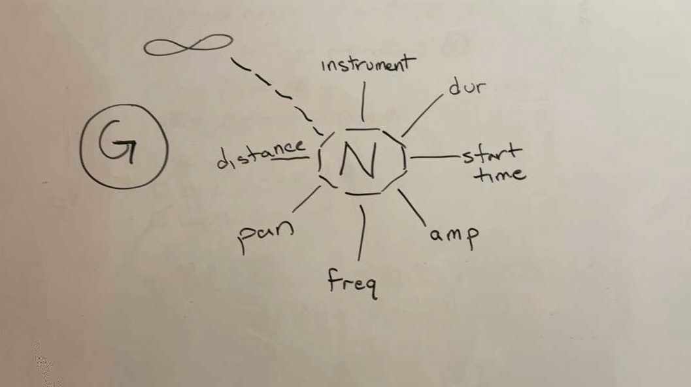
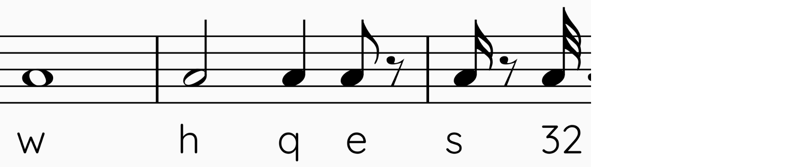
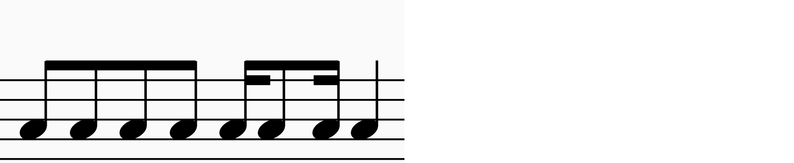
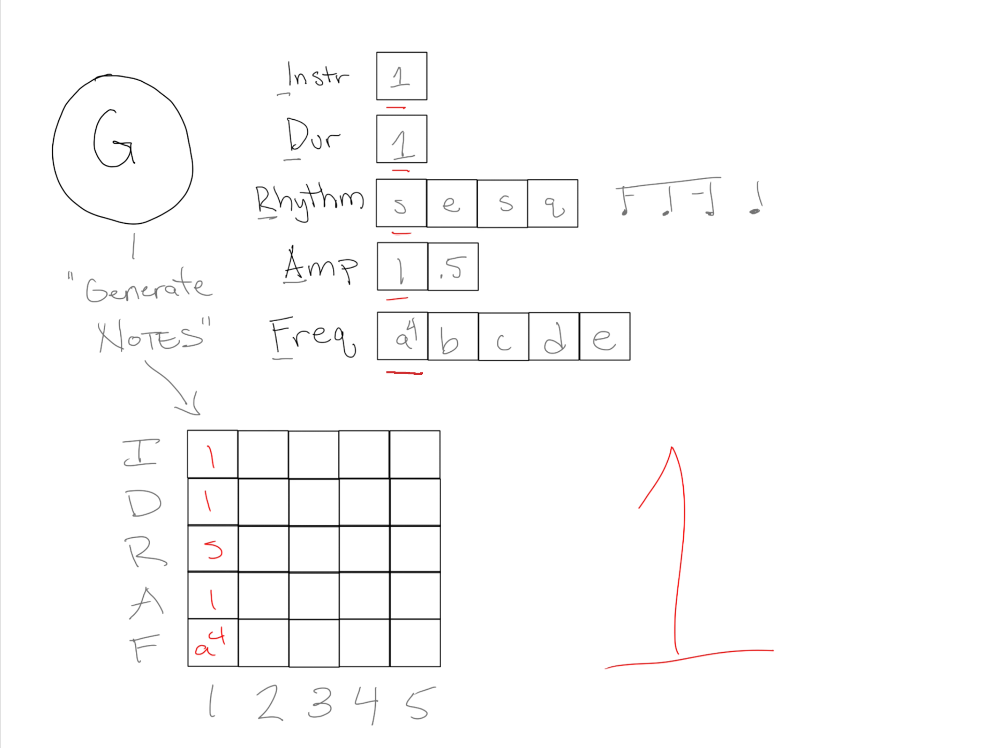
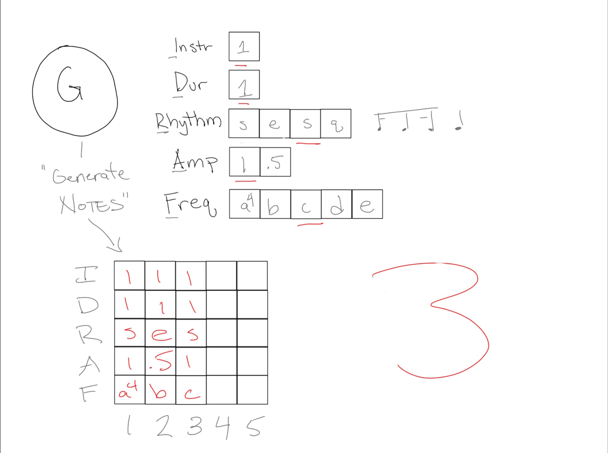
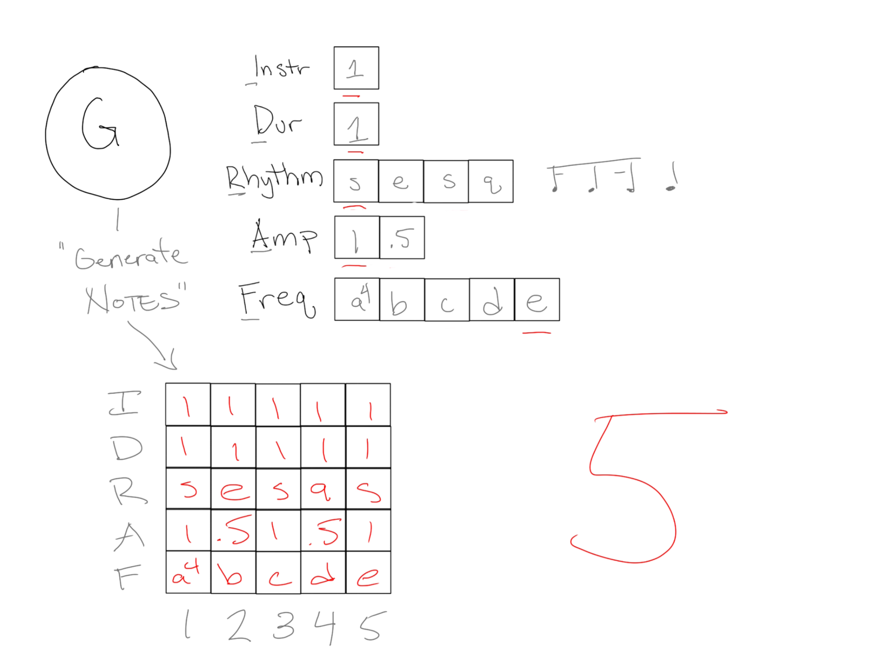

In this walkthrough, I'm going to focus on generating some simple notes that are read by a simple Csound orchestra, but the sky's the limit with Thuja, and it can be easily tweaked to generate any kind of event, like midi for synthesis, UDP for device control or inter-process communication, whatevs.

This whole thing right now is predicated on you knowing some python and knowing a little bit about Csound. [The Hello Csound tutorial from the FLOSS Manual](https://flossmanual.csound.com/get-started/GS-01)  is a good way to get up and running. We won't use any of the Csound front-ends - just '[plain csound](https://flossmanual.csound.com/how-to/installation)'.  Thuja is a python library for static and realtime / live coding. 

Thuja relies on a few concepts to generate sounds. 

# Generator

The Generator: it's the thing that generates the notes. As we all know, playing a note involves a bunch of different stuff that Thuja calls 'fields' in a note. A bunch of stuff, like:

- Which Instrument do I play the note on?
- When does the note start? (Start Time)
- How long is the note? (Duration)
- How loud is the note? (Amplitude)
- What's the pitch of the note? (Pitch :) ) 

You can extend this idea infinitely, and add all kinds of fields. I often have 3 fields to define stereo panning betweeen my speakers, distance from the listener, and amount of the note to send to a reverb.

So we know what we're going to generate - notes with 5 fields: Instr, Start Time, Duration, Amplitude, Pitch.

The fun part begins. The way generators work is: in a loop, they get asked for their next note until they're out of notes. When they have generated all of their notes, we have a complete score for the generator. So how do we change these notes? How do I make beats or a melody? By using itemstreams.

# Itemstreams

In the simplest case, an itemstream is a sequence of data that a generator uses to get values for a field in a note. 

In this picture, instr and dur each have a single item, rhythm has 4, amp has 2, freq has 5.

Everytime we ask the generator for it's next note, it will go through all the fields and ask the itemstream associated with every field for *its* next value. 

For the instrument and duration, it's just gonna keep spitting out 1. Since instrument 1 in my csound orchestra asks for amplitudes between 0 (silence) and 1 (loud), it'll alternate between 1 (full blast) and .5 (half volume).

### Pitches 

Pitches are notated using scientific pitch notation, pictured here. 

### Rhythm

Ok now rhythm. Think about playing a rhythm for a minute, something simple - just a stream of eighth-notes, let's say.  bum bum bum bum. Each note has a start time and when you're playing, you know when the next one is supposed to start. When you're computing these things, you need to know what rhythmic value you're playing.  To explain this briefly, just trust me that at 60 bpm, an eighth note is .5 seconds. If I say I'm going to play 4 eighth notes starting at time 0, you can tell me when each will start (0, .5, 1, 1.5). That's the gist.  See the main docs and examples for more explanation 

Here's each possibility:

Here's a simple example:

And a gross one.  You saw above that '32' was used for a 32nd note.  That number refers to a fraction of the note relative to a quarter note's duration, and *any* number can be used, like 12 to make a triplet.  When you're using a number for tuplets, you can think of them as a fraction of a bar of 4/4 - there are 12 triplet eighth-notes in a bar of 4/4. Complicated I know, but it's the solution I landed on.  

## Generating notes

When you call generate_notes on a Generator, it kicks off a loop that will repeated ask each of the configured item streams for their next value (get_next_value).

We'll go through 5 iterations to illustrate what's happening. In this first iteration, you see we get the first item in each stream.

The second, we see that instr and dur are the same, but the second item from rhythm, amp and freq are returned.

On the third, we see the amp sequence is back at the beginning.

The fourth and fifth:

And that's the foundation. It's a pretty simple lilbrary - you configure generators to emit these streams of data and bam: you have a score. There are lot of tweaks you can make to the behavior of Itemstreams, which is a concept borrowed from Rick Taube's Common Music library. You can randomize their values in different ways, and you can also say that one field is derived from the value of another, like the duration is always tied to the rhythm. Lots of possibilites, for behavior in the generator too. I've tried to just give the basic idea here.

In the examples, you'll see a few flavors of a Generator, mainly one called a "Line", but they are there as a convenience to make the Generators fit for different purposes. 
